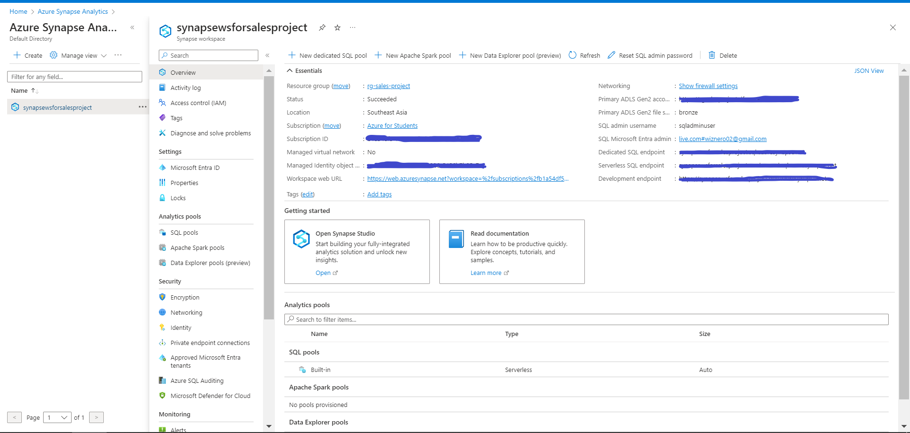
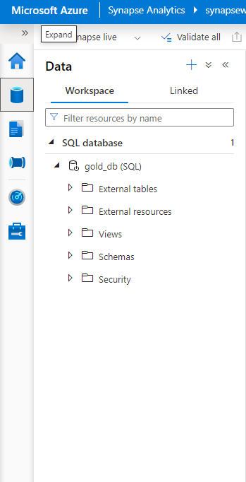
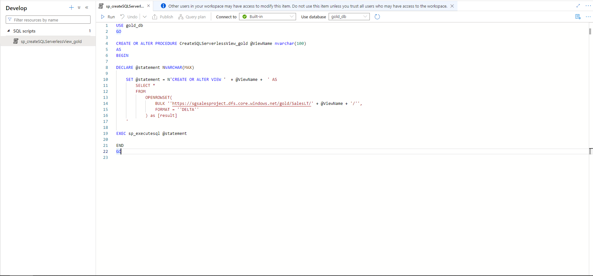
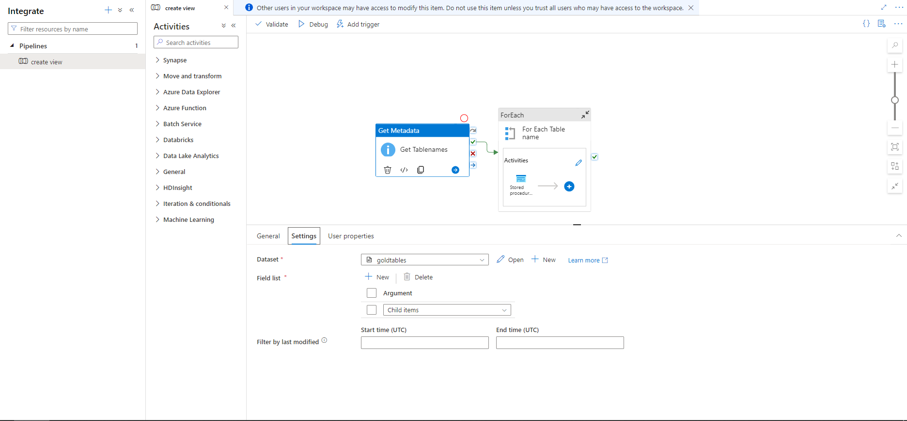
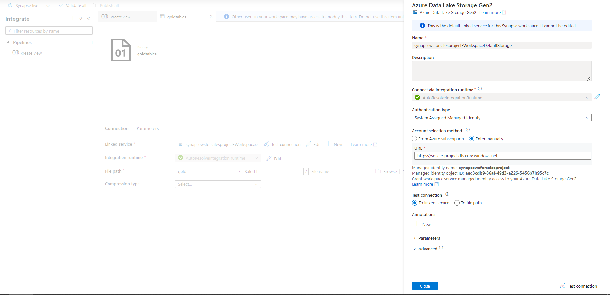
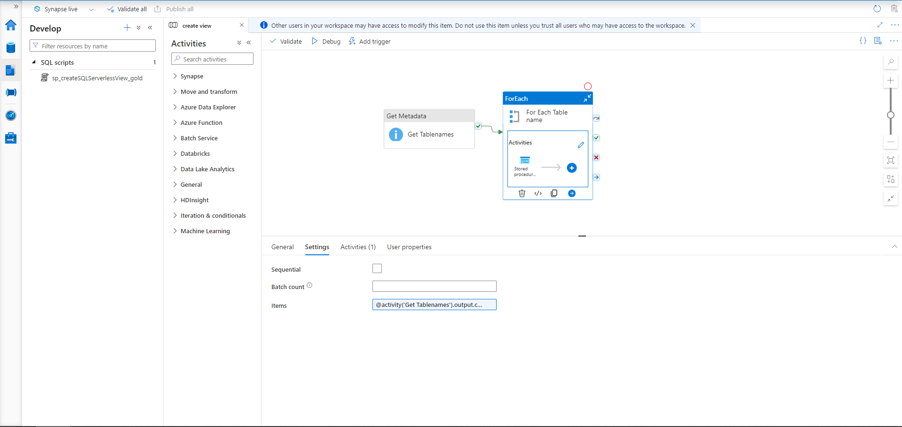
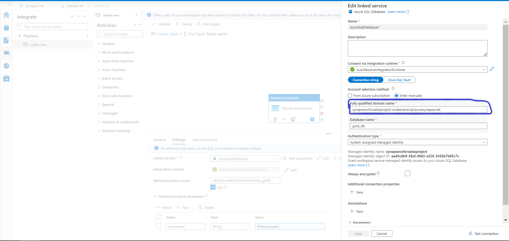

# Azure Synapse Analystic
Azure Synapse Analytics is an enterprise analytics service that accelerates time to insight across data warehouses and big data systems. It brings together the best of SQL technologies used in enterprise data warehousing, Apache Spark technologies for big data, and Azure Data Explorer for log and time series analytics.

### Table of contents

* [Overview](#overview)
  * [Workspace](#work-space)
  * [SQL Pools](#sql-pool)
  * [Database On-Cloud](#db-oncloud)
  * [Pipeline](#pipeline)

## Overview
### Workspace
Go to Azure UI -> Create Azure Synapse Analystic -> Resource Group (choose the one that we use for the project)

### SQL Pools
When you go with Synapse Analystic, that mean you store data on the cloud, and more we compute on the cloud, so the computing is call SQL Pool:

There two types: 
1. Dedicated SQL Pool
2. Serverless SQL Pool 
* Dedicated SQL Pool:
Designed for high-performance data warehousing workloads.
Provides guaranteed and consistent query performance.
Suitable for large-scale data processing with predictable needs.
Allows for scaling compute resources up or down based on workload requirements.
Ideal for organizations with dedicated data warehousing tasks.
Serverless SQL Pool:

* A pay-as-you-go option for running on-demand SQL queries.
No need to provision or manage dedicated compute resources.
Best suited for ad-hoc queries, data exploration, and on-demand analytics.
Billed only for the queries you run, making it cost-effective.
Offers flexibility without infrastructure management.
Choosing between these options depends on the nature of your workload, the need for consistent performance, and cost considerations. You can also use a combination of both options to meet different analytical needs within your organization.

### Database On-Cloud
Go to Azure Synapse Analystic -> Data tab -> + Add new resource(top left corner) -> SQL Database -> Serverless -> Type the name -> Create.

### Pipeline
Next, create a script to take all the data in each table at Gold layer and load to our database in Azure Synapse Analystic. You can found it from the folder "3 - Azure Synapse Analystic/script"

In the Integrate tabs, create a pipeline that take name from each table we store, create a view on top of each table via the script above, so it will mapping the data in the gold layer everytime we run the pipeline.

We need to create a Linked service to connect to ADLS Gen 2 from Azure Synapse, in the Dataset textbox-> new -> new connection.

Continue to the next activity, foreach, in this we will take the table name from the getMetadata before and each table we create the view using our script above.
Add this to the item textbox: @activity('Get Tablenames').output.childItems

Double click to Foreach activity, drag and drop Store procedure activity, in the setting part -> create new Linked Service to our On-cloud Database. You can found it from the main page of Azure.

After you found it, paste it to the "Fully qualified domain name" text box. Choose the script that I give you in the script folder.

Remember to create new Stored procedure parameters, so it can take the item from the previous activity which is getMetadata and give us table name.

Voila! You have been through 90% of the project. Next, we gonna use PowerBI to visualize our database.

