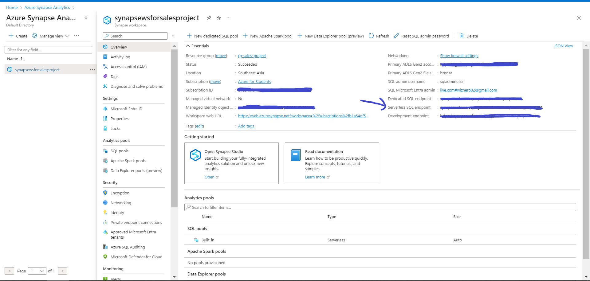

# Power BI
Power BI is a unified, scalable platform for self-service and enterprise business intelligence (BI). Connect to and visualize any data, and seamlessly infuse the visuals into the apps you use every day.

### Table of contents

* [Overview](#overview)
  * [Power BI desktop](#pwbi-desktop)
* [Congrats!](#congrats)

## Overview
### Power BI desktop
I will use Power BI desktop for this project, if you want, choose any BI tools you want to go with like Tableau, etc...

Rememeber our SQL Serverless Endpoint paste it to the Server, quite simple right!

Click to Model view, you see that two of the table that haven't been referenced yet. Choose the Manage relationship icon -> New. 

## Congrats
You have completed this project! and If you're considering broadening the scope of this project, here are some intriguing suggestions:

1. Experiment with dbt (Data Build Tool) for seamless data integration.
2. Develop a comprehensive Data Warehouse.
3. Incorporate Machine Learning for sophisticated data insights.

While these steps may seem ambitious, they provide a remarkable pathway for continuous learning and growth in this domain.
And one last thing well done, and best regards! If you encounter any issue, remember to contact me with the info below.
